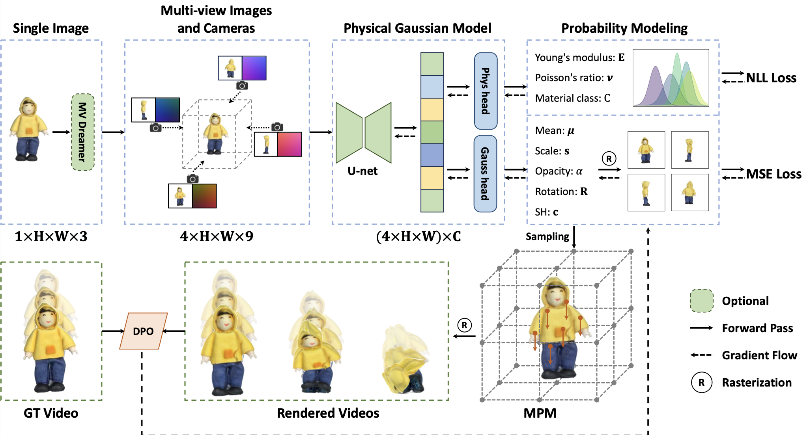

# PhysGM: Large Physical Gaussian Model for Feed-Forward 4D Synthesis

## 作者

- **Chunji Lv**<sup>1</sup> - [个人主页](https://hihixiaolv.github.io/PhysGM.github.io/)
- **Zequn Chen**<sup>2</sup> - [个人主页](https://hihixiaolv.github.io/PhysGM.github.io/)
- **Donglin Di**<sup>2</sup> - [个人主页](https://hihixiaolv.github.io/PhysGM.github.io/)
- **Weinan Zhang**<sup>3</sup> - [个人主页](https://hihixiaolv.github.io/PhysGM.github.io/)
- **Hao Li**<sup>2</sup> - [个人主页](https://hihixiaolv.github.io/PhysGM.github.io/)
- **Wei Chen**<sup>2</sup> - [个人主页](https://hihixiaolv.github.io/PhysGM.github.io/)
- **Changsheng Li**<sup>1</sup> - [个人主页](https://hihixiaolv.github.io/PhysGM.github.io/)

<sup>1</sup>北京理工大学 &nbsp;&nbsp;&nbsp;&nbsp; <sup>2</sup>理想汽车 &nbsp;&nbsp;&nbsp;&nbsp; <sup>3</sup>哈尔滨工业大学

## 链接

- 📄 [arXiv论文](https://arxiv.org/abs/2508.13911)
- 💻 [代码仓库](https://github.com/YOUR REPO HERE) (即将发布)

## 摘要

虽然基于物理的3D运动合成已经取得了显著进展，但当前方法仍面临关键限制。它们通常依赖于预重构的3D高斯溅射(3DGS)表示，而物理集成则依赖于要么不灵活的手动定义物理属性，要么来自视频模型的不稳定、优化密集的指导。为了克服这些挑战，我们引入了**PhysGM**，这是一个前馈框架，能够从单张图像联合预测3D高斯表示及其物理属性，实现即时的物理模拟和高保真4D渲染。

我们首先通过联合优化高斯重构和概率物理预测来建立基础模型。然后使用物理上合理的参考视频来细化模型，以提高渲染保真度和物理预测准确性。我们采用直接偏好优化(DPO)来将其模拟与参考视频对齐，避免了分数蒸馏采样(SDS)优化，后者需要通过复杂的可微分模拟和光栅化进行反向传播梯度。

为了促进训练，我们引入了一个新的数据集PhysAssets，包含超过24,000个3D资产，标注了物理属性和相应的指导视频。实验结果表明，我们的方法能够在一分钟内从单张图像有效生成高保真4D模拟。这代表了相对于先前工作的显著加速，同时提供了逼真的渲染结果。

## 架构



**PhysGM的架构。** 模型以一个或多个输入视图及其对应的相机参数为条件，这些参数通过U-Net编码器处理以产生共享潜在表示*z*。然后这个潜在表示被两个并行头部解码：(1)一个*高斯头部*预测初始3D高斯场景参数*ψ*，以及(2)一个*物理头部*预测物体物理属性*θ*的分布。采样的参数(*ψ*, *θ*)初始化材料点方法(MPM)模拟器以生成最终的动态序列。整个架构采用两阶段范式训练：首先，在真实数据上的监督预训练建立强大的生成先验。随后，基于DPO的微调阶段使用与真实视频的排名并调整模型以产生物理上合理的结果。

## 演示视频

### 掉落场景


### 拉伸场景


### 多物体交互场景


### 真实场景


## 其他结果

我们展示了更多PhysGM生成的结果：

- [other24.mp4](static/videos/other24.mp4)
- [other17.mp4](static/videos/other17.mp4)
- [other26.mp4](static/videos/other26.mp4)
- [other15.mp4](static/videos/other15.mp4)
- [other7.mp4](static/videos/other7.mp4)
- [other16.mp4](static/videos/other16.mp4)
- [other1.mp4](static/videos/other1.mp4)
- [other2.mp4](static/videos/other2.mp4)
- [other3.mp4](static/videos/other3.mp4)
- [other4.mp4](static/videos/other4.mp4)
- [other5.mp4](static/videos/other5.mp4)
- [other6.mp4](static/videos/other6.mp4)
- [other8.mp4](static/videos/other8.mp4)
- [other9.mp4](static/videos/other9.mp4)
- [other10.mp4](static/videos/other10.mp4)
- [other12.mp4](static/videos/other12.mp4)
- [other13.mp4](static/videos/other13.mp4)
- [other14.mp4](static/videos/other14.mp4)
- [other18.mp4](static/videos/other18.mp4)
- [other21.mp4](static/videos/other21.mp4)
- [other22.mp4](static/videos/other22.mp4)
- [other23.mp4](static/videos/other23.mp4)
- [other27.mp4](static/videos/other27.mp4)
- [other28.mp4](static/videos/other28.mp4)

## 引用

如果您发现我们的工作有用，请引用我们的论文：

```bibtex
@misc{lv2025physgmlargephysicalgaussian,
  title={PhysGM: Large Physical Gaussian Model for Feed-Forward 4D Synthesis}, 
  author={Chunji Lv and Zequn Chen and Donglin Di and Weinan Zhang and Hao Li and Wei Chen and Changsheng Li},
  year={2025},
  eprint={2508.13911},
  archivePrefix={arXiv},
  primaryClass={cs.CV},
  url={https://arxiv.org/abs/2508.13911}, 
}
```

## 许可证

本项目基于 [Academic Project Page Template](https://github.com/eliahuhorwitz/Academic-project-page-template) 构建，该模板改编自 [Nerfies](https://nerfies.github.io) 项目页面。本网站采用 [Creative Commons Attribution-ShareAlike 4.0 International License](http://creativecommons.org/licenses/by-sa/4.0/) 许可。